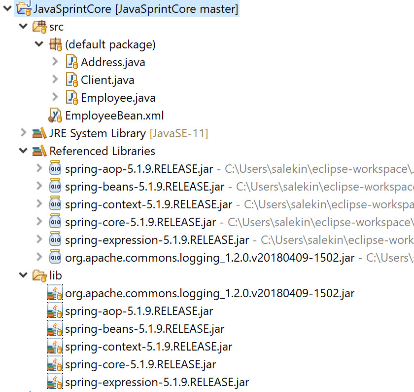

<h2>Java Spring Core skeleton</h2>

<h3>Spring Core Container</h3>
  <ul>
    <li><b>Core:</b> Provices the fundamental parts of the framework.</li>
    <li><b>Bean:</b> Provides BeanFactory.</li>
    <li><b>Context:</b> It is a medium to access any objects defined and configured.</li>
    <li><b>SpEL:</b> Provides a powerful expression language.</li>
  </ul>
  
<h3>Start Coding in 5 Simple Steps</h3>
  <ul>
		<li>Bean or Model or POJO Class</li>
      <ul>
        <li>Xml file</li>
          <ul>
		        <li>Demo Class</li>
              <ul>
                <li>Load jar files</li>
                  <ul>
		                <li>Run</li>
                  </ul>
              </ul>
          </ul>
      </ul>
  </ul>

<h3>Project Sturcture</h3>

<h3>How to add external libraries</h3>
<ul>
  <li>Create a forlder in the project (example: "lib")</li>
  <li>Go to the below link and download "spring-framework-5.1.9.RELEASE-dist.zip"</li>
  <link>https://repo.spring.io/release/org/springframework/spring/5.1.9.RELEASE/</link>
  <li>Unzip and copy below jars to "lib" folder</li>
    <ul>
      <li>spring-aop-5.1.9.RELEASE.jar</li>
      <li>spring-beans-5.1.9.RELEASE.jar</li>
      <li>spring-context-5.1.9.RELEASE.jar</li>
      <li>spring-core-5.1.9.RELEASE.jar</li>
      <li>spring-expression-5.1.9.RELEASE.jar</li>
    </ul>  
  <li>Go to any of the below link and download "spring tool suite 4"</li>
  <link>https://spring.io/tools</link>
  <link>https://download.springsource.com/release/STS4/4.3.2.RELEASE/dist/e4.12/spring-tool-suite-4-4.3.2.RELEASE-e4.12.0-win32.win32.x86_64.zip</link>
  <li>Unzip and copy below jars to "lib" folder</li>
    <ul>
      <li>org.apache.commons.logging_1.2.0.v20180409-1502.jar</li>
    </ul>  
  <li>Now follow the below steps</li>
    <ul>
      <li>right-click the project name</li>
        <ul>
          <li>Build Path</li>
            <ul>
              <li>Configure Build Path</li>
                <ul>
                  <li>select Libraries Tab</li>
                    <ul>
                      <li>select Classpath</li>
                        <ul>
                          <li>Click Add External JARS</li>
                            <ul>
                              <li>Browse to the lib folder and add all the jars</li>
                            </ul>
                        </ul>
                    </ul>
                </ul>
            </ul>
        </ul>
    </ul>

<h3>Understanding Spring Core | IOC (Inversion of Control)</h3>
  <ul>
    <li>You don't create objects.</li>
    <li>Objects shall be configured in an XML file by the developer.</li>
    
(so, we need to mention the data which these attributes will store in an xml file. Benifits of having such an object is that our XML files are not part of source code, so we can configure or manipulate the values at any time and our object will be constructed accordingly.)

    <li>Spring Container -> Responsible to construct the Java Objects by parsing XML file.</li>
  </ul>
  
<h3>Understanding Spring Core | BeanFactory & ApplicationContext</h3>
  
BeanFactory is nothing but a spring container which shall read or which shall parse XML 
file and construct the objects. Here, we don't construct the objects now.

  
  
So objects are constructed by the spring container and we are just obtaining the reference 
to the object.

  
  
ApplicationContext is also one of the core container in the spring framework which is used
to do the inversion of control. It's basically an implementaion of the bean package. 
ApplicationContext is basically built on top of bean pattern.

  
<h5>Differences:</h5>
  <ul>
    <li>ApplicationContext will create the object for us eventhough we don't request.</li>
    <li>Beanfactory will create the object for us only when we are going to request for it(by calling the getbean method).</li>
  </ul>
  
  
So, spring inversion of control says that you don't create objects, objects will be constructed by the spring core container.

  
<h3>IOC-Features</h3>
  <ol>
    <li>Construction of the objects</li>
    <li>Managing the entire lifecycle of the objects is not a headache of the developer now</li>
    <li>Wiring them together (there might be dependencies which we can link up)</li>
    <li>Configuration (means key-value pair, just need to configure the object in the xml file)</li>
  </ol>
    
<h3>Dependency Injection</h3>
  
Followed 2 types of dependency injection here.

  <ul>
    <li>Constructor Injection</li>
    <li>Setter Injection</li>
  </ul>
